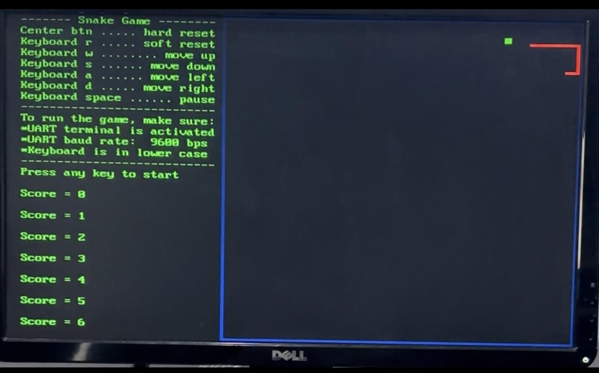

# Causality SoC

This project is my take on the Introduction to SoC course offered by Arm, which you can find here: https://www.arm.com/resources/education/education-kits/introduction-to-soc. After completing the course, I designed a custom SoC on a Digilent Basys 3 FPGA using HDL, then developed a Hardware Abstraction Layer (HAL) on top of it to expose clean, reusable APIs for the on-chip peripherals. The repository includes a minimal BSP, startup code, and demo applications; it’s intended as a learning platform you can fork, modify, and extend—such as by adding I²C/SPI support or porting the design to a different board.

### What This System Includes

**ARM Cortex-M0 Processor Core**
- Official ARM DesignStart IP (free evaluation version)
- 32-bit RISC architecture with Thumb instruction set
- Industry-standard processor used in billions of IoT devices
- Complete NVIC (Nested Vectored Interrupt Controller)

**Professional Bus Architecture**
- AHB-Lite (AMBA 3.0) bus protocol
- Memory-mapped peripheral architecture
- Address decoder and bus multiplexer
- Industry-standard interconnect system

**Rich Peripheral Set**
- VGA Controller
- UART
- Timer
- GPIO
- 7-Segment Display
- Block RAM

**Complete Software Stack**
- ARM CMSIS (Cortex Microcontroller Software Interface Standard)
- Hardware Abstraction Layer (HAL) for easy programming
- Interrupt service routines and real-time programming

## Demonstration Software: Snake Game




The system includes a complete **Snake game** implementation that showcases all system capabilities:

### Game Features
- **Real-time graphics** rendering on VGA display
- **Keyboard input** via UART serial terminal
- **Collision detection** (walls and self-collision)
- **Interrupt-driven** responsive controls
- **Game state management** (play, pause, game over)

## Development Environment

### Hardware Design (HDL)
- **Vivado Design Suite**
- **Verilog HDL**
- **ARM Cortex-M0 DesignStart IP**

### Software Development
- **Keil uVision IDE** 
- **C and Assembly**
- **ARM CMSIS**
- **Custom Hardware Abstraction Layer**

## Project Structure

```
Intro_SoC/
├── HDL/                           # Hardware Description Language
│   ├── AHBLITE_SYS.v             # Top-level SoC integration
│   ├── CortexM0-DS/               # ARM Cortex-M0 processor IP
│   ├── AHB_BRAM/                  # Memory controller
│   ├── AHB_VGA/                   # VGA display system
│   ├── AHB_UART/                  # Serial communication
│   ├── AHB_TIMER/                 # Timer/counter peripheral
│   ├── AHB_GPIO/                  # General purpose I/O
│   ├── AHB_7SEG/                  # 7-segment display
│   └── AHB_BUS/                   # Bus interconnect
├── Software/                      # Embedded software
│   ├── app/                       # Snake game application
│   ├── SoC_hal/                   # Hardware abstraction layer
│   ├── bsp/                       # Board support package
│   ├── core/                      # ARM CMSIS headers
```

## Quick Start Guide

### Prerequisites
- Basys 3 FPGA development board
- Vivado Design Suite
- VGA monitor and VGA cable
- Serail Monitor (Putty, Terra Term)
- USB cable
- Keil uVision

### Running the Demo
1. Generate the bitstream in Vivado and program it onto the FPGA
2. Compile the source code in Keil uVision or with your preferred toolchain
3. Place the compiled hex file (code.hex) in the HDL/AHB_BRAM/ directory
4. Connect the VGA monitor to the FPGA board
5. Connect the USB cable from your PC to the FPGA board
6. Open your preferred terminal software with these settings:
   - 9600 baud, 8 data bits, no parity, 1 stop bit (8N1)
7. Press any key to start the game
8. Use W/A/S/D keys to control the snake

## Applications and Extensions

## Conclusion

This ARM Cortex-M0 SoC project provides a complete, hands-on introduction to embedded systems design. It bridges the gap between theoretical knowledge and practical implementation, using professional tools and industry-standard architectures.

Whether you're a student learning embedded systems, an educator teaching digital design, or a professional exploring FPGA-based prototyping, this project offers a comprehensive platform for understanding how modern embedded systems really work.

This project was great because it gave me the opportunity to delve deeper into:
- Hardware-software co-design using professional ARM IP
- Industry-standard bus protocols (AHB-Lite) and memory-mapped I/O
- Real-time embedded programming with interrupt handling
- FPGA development using Vivado and Verilog HDL
- The complete embedded systems development flow from hardware design to application software

In the future I would like to add I2C and SPI support and write more demo programs that will make use of those serial communication protocols. Please feel free to fork this repo and add or customize the hardware or write more application programs!! That is the beauty of this project: you are free to add or change the hardware and, with a few tweaks to the HAL, keep the same software running—so experiment, share what you build, and send a PR with examples and notes for others to learn from!
