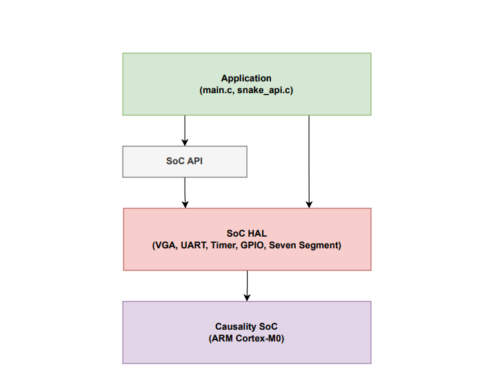

# Software Implementation

This directory contains the complete embedded software stack for the ARM Cortex-M0 SoC, demonstrating professional embedded systems programming with a layered architecture.

## Software Architecture

The software follows a **hierarchical design** with clean separation between hardware and application:

## Key Components

### 1. Snake Game Application (`app/`)
- **Complete game**: Real-time graphics, collision detection, score tracking
- **Interrupt-driven controls**: Responsive keyboard input via UART
- **Game state management**: Play, pause, restart, game over

### 2. Hardware Abstraction Layer (`SoC_hal/`)

#### VGA Graphics (`SoC_VGA.c/h`)
- **Text console**: 80×30 character display with printf support
- **Graphics**: Multi-resolution framebuffer (2×2, 4×4, 8×8 scaling)
- **Drawing functions**: Pixels, lines, rectangles
- **8-bit color**: RGB 3-3-2 format

#### UART Communication (`SoC_uart.c/h`)
- **Serial I/O**: interrupt-driven
- **Standard I/O**: Printf/scanf support through UART displayed on VGA  text console
- **Game interface**: Keyboard controls for Snake game

#### Timer/Counter (`SoC_timer.c/h`)
- **Game timing**: Periodic interrupts for game updates
- **Multiple modes**: Free-run, periodic, PWM, capture
- **Configurable**: Prescaler and load value settings

#### GPIO Controller (`SoC_gpio.c/h`)
- **16-bit I/O**: Switch input and LED output
- **Board interface**: Basys 3 switches and LEDs

#### 7-Segment Display (`SoC_seven_segment.c/h`)
- **4-digit display**: Score and status display
- **Hex/decimal modes**: Flexible number display (Hex mode or Decimal mode)

### 3. Board Support Package (`bsp/`)
- **Interrupt handlers**: UART and Timer ISRs for game operation
- **System startup**: ARM assembly initialization code
- **Standard library**: Printf/scanf retargeting to UART

### 4. ARM CMSIS (`core/`)
- **ARM standards**: Cortex-M0 core definitions and functions
- **NVIC management**: Interrupt controller support
- **Portable code**: Standard ARM embedded interface
